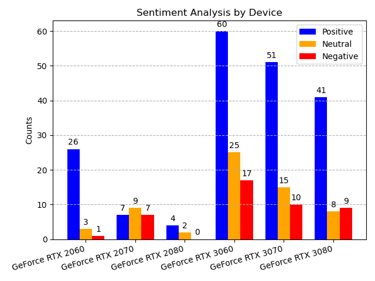

# CS 325 Project Part 3 - Sentiment Analysis of eBay Product Reviews
## Introduction
This is the third part of the CS325 Project where all the code form the previous parts comes thogether.

This project performs sentiment analysis on eBay product reviews. It combines web scraping (Part 2), sentiment analysis using a Large Language Model (LLM) via an Ollama instance(Part 1), output parsing, and data visualization to provide insights into customer opinions on various products.  

## Features
- **Web Scraping:** Collects product reviews from eBay using BeautifulSoup and requests.
- **Sentiment Analysis:** Utilizes an LLM through Ollama to classify the sentiment of each review.
- **Output Parsing:** Processes LLM outputs to categorize sentiments accurately, even with variations in wording.
- **Visualization:** Generates bar charts to display sentiment distribution for each product.

## Prerequisites
- **Python:** Version 3.7 or higher (tested with version 3.11)
- **Ollama:** An instance of Ollama running and accessible (can be on a remote server)
- **Internet Connection:** Required for web scraping and model downloading

## Installation
1. **Clone the repository:**  
    ```bash 
    git clone https://github.com/Flo-Wei/CS325-Project.git
    cd CS325-Project/Part3
    ```
2. **Install dependencies:**  
    ```bash
    pip install -r requirements.yml
    ```

## Configuration
### Input File (`review_files/input_file.json`)
The `input_file.json` contains:

**prompt_template:** The template for prompting the LLM. Use `{review}` as a placeholder for the review text.
**items:** A list of products with their name and eBay review link.  

**Example:**
```json
{
  "prompt_template": "Analyze the sentiment and respond with 'positive,' 'neutral,' or 'negative'. \n\n{review}",
  "items": [
    {
      "name": "Product A",
      "link": "https://www.ebay.com/urw/Product-A/product-reviews/1234567890"
    },
    {
      "name": "Product B",
      "link": "https://www.ebay.com/urw/Product-B/product-reviews/0987654321"
    }
  ]
}
```
### Main Script Configuration (`main.py`)
Edit the `main()` function call in `main.py` to set your configurations:

```python
main(
    input_file="Part3/review_files/input_file.json",
    reviews_file="Part3/review_files/reviews_file.json",
    ollama_address="http://localhost:11434",
    model_name="llama2",
    log_level="INFO",
    max_review_pages=None
)
```
- **input_file:** Path to your input JSON file.
- **reviews_file:** Path to save scraped reviews.
- **ollama_address:** Ollama host URL (`localhost` for local instance).
- **model_name:** Name and tag of the LLM model to use.
- **log_level:** Logging level (DEBUG, INFO, WARNING, ERROR, CRITICAL).
- **max_review_pages:** Maximum number of review pages to scrape (None for all pages).

## Usage
1. **Prepare the Input File:**  
    Update `review_files/input_file.json` with the products and prompt template you want to use.

2. **Run the Main Script:**
    ```bash
    python main.py
    ```

3. **View the Results:**

    A bar chart displaying sentiment counts will be generated.  

    The Barchart below shows an example of all the reviews of select GPUs from the Nvidia RTX series:
      

    Scraped reviews are saved in `review_files/reviews_file.json`.

## Module Descriptions
- **main.py:** Orchestrates the workflow by combining web scraping, sentiment analysis, parsing, and visualization.
- **code/**
    - **webscraping.py:** Handles scraping reviews from eBay product pages.
    - **LLM.py:** Manages interactions with the Ollama LLM, including model checks and sentiment analysis.
    - **OutputParser.py:** Parses LLM outputs to classify sentiments using fuzzy matching.
    - **utils.py:** Contains utility functions for plotting and data handling.
    - **\*_test.py:** Contains unit tests for respective modules.

## License
This project is for educational purposes. Please ensure compliance with eBay's terms of service when scraping data.

## Contact
For any questions or suggestions, please contact Florian Weigelt at fweigel@siue.edu.